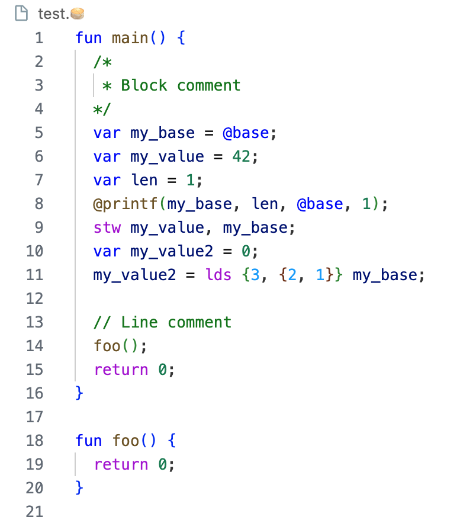

# Pancake Syntax Highlighting Extension

This VS Code extension provides syntax highlighting for the Pancake programming language.

## Features

- Syntax highlighting for Pancake language keywords, functions, variables, and more.
- Support for both light and dark color themes.

*Pancake syntax highlighting with a light color theme*

*Pancake syntax highlighting with a dark color theme*

## Installation

1. Open Visual Studio Code.
2. Open the Extensions view by clicking on the square icon in the Activity Bar on the side of VS Code or by pressing `Ctrl+Shift+X` (Windows, Linux) or `Cmd+Shift+X` (macOS).
3. Search for "Pancake Syntax" in the Extensions view search bar.
4. Click the "Install" button for the "Pancake Syntax" extension.
5. Once installed, the extension will be automatically activated when you open a file with a `.pnk` or `.🥞` extension.

Alternatively, you can clone this repository and copy into your local `.vscode/extensions`:
1. `git clone https://github.com/JunmingZhao42/pancake-vscode-highlight.git`
2. `cp -r pancake-vscode-highlight $HOME/.vscode/extensions/`
3. Reload VScode

## Contributing

If you encounter any issues or have suggestions for improvements, please feel free to open an issue or submit a pull request on the [GitHub repository](https://github.com/JunmingZhao42/pancake-vscode-highlight.git).

## Release Notes

### 1.0.0

- Initial release of the Pancake Syntax Highlighting extension.

---

**Enjoy coding in Pancake with enhanced syntax highlighting!**